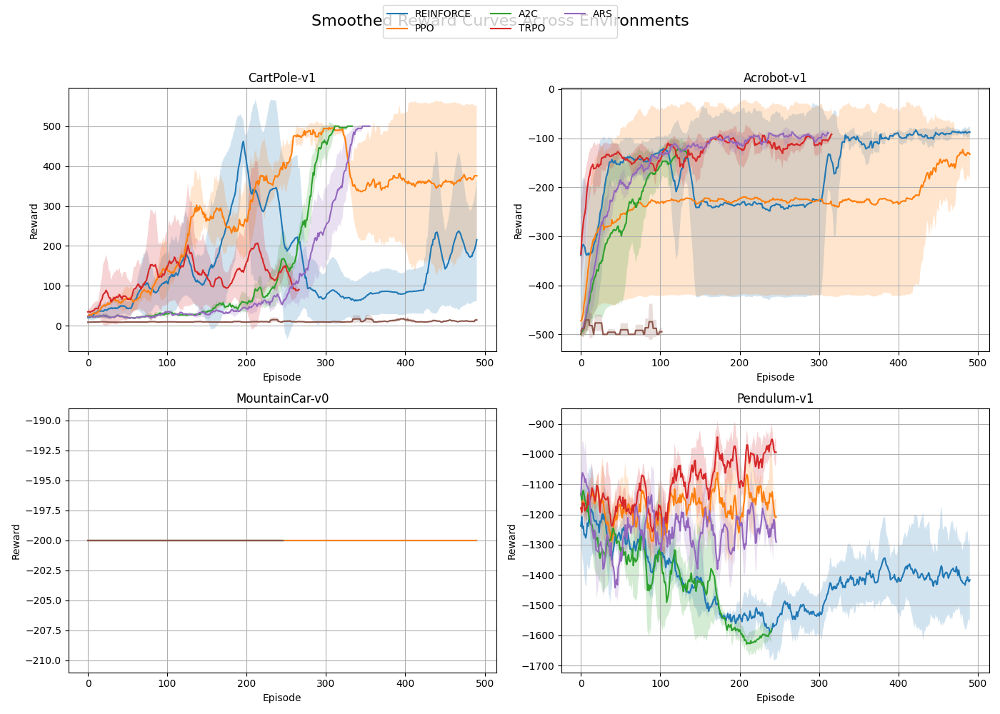
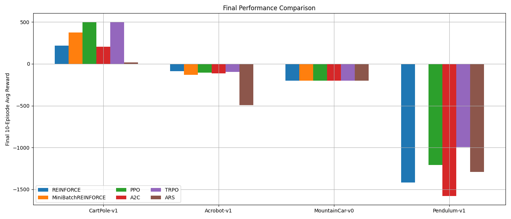
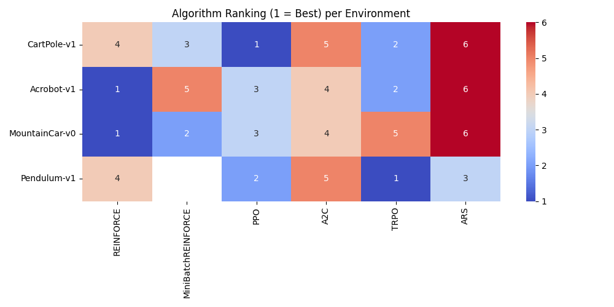

# Actor-Critic Algorithms

Reproducing code (on Mac):

```bash
python -m venv venv
source venv/bin/activate
pip install -r requirements.txt
```

You can run experiments using `main.py` as entry point. It has config specified in it.
My implementations of REINFORCE and minibatch-REINFORCE can be found in `algorithms` directory

## a) Evaluation Study Using Gymnasium Classic Environments
> Conduct an rliable-based evaluation study across all Gymnasium classic control environments, using as many seeds per environment as feasible. Include your implementations of REINFORCE and Mini-batch REINFORCE, as well as the following pre-implemented (partially SOTA) algorithms: ARS, A2C, DDPG, PPO, SAC, TD3, TQC, and TRPO.

For some environments, classic version of REINFORCE will not work due to continuous action space (e.g. Pendulum-v1). In order to apply this algorithm to all environments, we alter it to deal with continuous action space. 


This study evaluates various policy-gradient-based algorithms on a suite of classic control tasks from Gymnasium. We include both custom implementations and state-of-the-art actor-critic methods. The primary objective is to assess convergence behavior, stability across random seeds, and overall policy quality.

### **Algorithms Evaluated**

- **Custom Implementations**:
  - REINFORCE
  - MiniBatch REINFORCE
- **Pre-Implemented (Stable Baselines3 / SB3-Contrib)**:
  - PPO (Proximal Policy Optimization)
  - A2C (Advantage Actor-Critic)
  - TRPO (Trust Region Policy Optimization)
  - ARS (Augmented Random Search)
  - DDPG (Deep Deterministic Policy Gradient)
  - SAC (Soft Actor-Critic)
  - TD3 (Twin Delayed DDPG)
  - TQC (Truncated Quantile Critics)

Note: Due to discrete action spaces in CartPole, Acrobot, and MountainCar, we excluded DDPG, TD3, SAC, and TQC from those environments. They were instead tested on the continuous environment **Pendulum-v1**.

### **Environments**
- CartPole-v1 (discrete)
- Acrobot-v1 (discrete)
- MountainCar-v0 (discrete)
- Pendulum-v1 (continuous)

Each algorithm was trained using **3 random seeds**, and all training reward curves were collected using a custom wrapper or monitor to ensure fair comparison across agents.

---

### Visualizations

#### 1. Smoothed Reward Curves
A moving average (window=10) is used to smooth training reward curves. Shaded regions indicate one standard deviation across seeds.



- PPO, TRPO, and MiniBatch REINFORCE exhibit strong and stable learning curves in CartPole.
- TRPO demonstrates the best convergence speed and final reward on Pendulum.
- ARS performs poorly in almost all environments except for a brief spike in CartPole, likely due to random exploration.
- A2C shows consistent early improvements but flattens below top performance levels.
- MountainCar remains unsolved across algorithms, which is consistent with its sparse reward structure.

#### 2. Final Performance Bar Plot
Each bar represents the average of the last 10 episode rewards across seeds, per environment and algorithm.



- PPO and TRPO achieve the highest final performance in CartPole and Pendulum.
- In Acrobot, A2C and TRPO are competitive, while MiniBatch REINFORCE underperforms.
- As expected, MountainCar-v0 shows uniformly poor scores across the board.

#### 3. Algorithm Ranking Heatmap
This matrix shows per-environment rankings based on final average performance.



- TRPO achieves the top rank in Pendulum.
- PPO tops CartPole.
- REINFORCE unexpectedly ranks high in MountainCar and Acrobot, possibly due to lucky gradient estimates.
- ARS consistently ranks last.

---

### Summary of Insights

- **Convergence**: PPO and TRPO achieve fast and stable convergence across most environments. TRPO is particularly effective in continuous action settings like Pendulum.
- **Variance**: Custom REINFORCE methods show higher variance and often struggle with stability.
- **Environment Sensitivity**: MiniBatch REINFORCE is more sample-efficient than vanilla REINFORCE but doesn’t outperform actor-critic methods.
- **Hardness of Environment**: Sparse-reward environments like MountainCar-v0 remain challenging for all agents.

This analysis sets the stage for further work on sample efficiency, generalization, and robustness across more complex benchmarks.


## b) Comparison to tabular setting

> Compare the evaluation metrics to those used in the tabular setting. What differences do you observe? Why do these differences arise, and why is the rliable package particularly useful when evaluating algorithms in more complex environments? What suggestions do you derive in order to better compare how good algorithms are in a tabular setting?


In tabular reinforcement learning settings, evaluation metrics are often deterministic and focused on the exact values of state-action functions or policy optimality. A single training run with sufficient episodes typically yields reproducible results, and convergence is guaranteed under mild assumptions. Evaluation is straightforward: either the agent has learned the optimal table of values or it hasn’t.

In contrast, function approximation settings (such as those involving neural networks in Gymnasium environments) introduce significant stochasticity. Policy performance can vary greatly across different seeds, and training dynamics are unstable. In these environments, evaluation must involve multiple seeds, statistical aggregation (mean, IQM), and visualization techniques that express uncertainty (e.g., confidence intervals or shaded standard deviation regions).

This is where the rliable package proves highly useful. It provides statistically robust metrics like Interquartile Mean (IQM), bootstrap-based confidence intervals, and probability of improvement matrices that are vital for interpreting noisy outcomes. These tools help ensure that comparisons between algorithms are meaningful and not distorted by random seed outliers or unstable learning trajectories.

To improve evaluation in tabular settings, it would still be beneficial to adopt some of these practices. Running multiple seeds (even if convergence is usually guaranteed) and visualizing convergence rates or sample efficiency can provide additional insight into the learning behavior. This allows for detecting issues such as variance from implementation differences, overly optimistic assumptions, or suboptimal sample usage.
