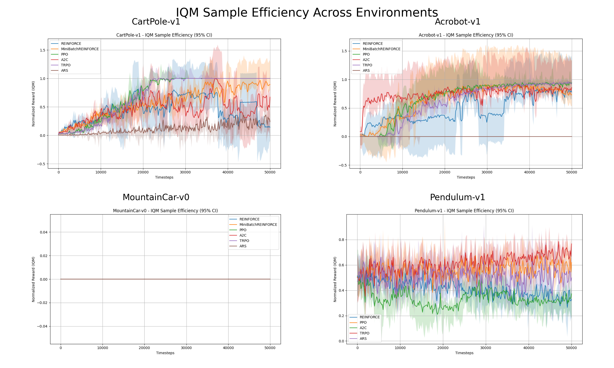

<h1>Actor-Critic Algorithms</h1>

<strong>Author:</strong> Bagautdin Nukhkadiev

<h3>Reproducing code (on Mac):</h3>
<pre><code>python -m venv venv
source venv/bin/activate
pip install -r requirements.txt
</code></pre>

You can run experiments using <code>main.py</code> as the entry point. It has config specified in it. 
My implementations of REINFORCE and MiniBatch REINFORCE can be found in the <code>algorithms</code> directory.

Algorithm rewards are logged in the <code>results</code> directory.

<h2>a) Evaluation Study Using Gymnasium Classic Environments</h2>
<blockquote>
  Conduct an rliable-based evaluation study across all Gymnasium classic control environments, using as many seeds per environment as feasible. Include your implementations of REINFORCE and Mini-batch REINFORCE, as well as the following pre-implemented (partially SOTA) algorithms: ARS, A2C, DDPG, PPO, SAC, TD3, TQC, and TRPO.
</blockquote>

For some environments, classic REINFORCE will not work due to continuous action spaces (e.g., Pendulum-v1). We modified it to handle continuous actions and enable full evaluation.

This study evaluates various policy-gradient-based algorithms on a suite of classic control tasks from Gymnasium. We include both custom implementations and state-of-the-art actor-critic methods. The goal is to assess convergence behavior, stability across random seeds, and final policy quality.

<h3><strong>Algorithms Evaluated</strong></h3>
<ul>
  <li><strong>Custom Implementations</strong>:
    <ul>
      <li>REINFORCE</li>
      <li>MiniBatch REINFORCE</li>
    </ul>
  </li>
  <li><strong>Pre-Implemented (Stable Baselines3 / SB3-Contrib)</strong>:
    <ul>
      <li>PPO (Proximal Policy Optimization)</li>
      <li>A2C (Advantage Actor-Critic)</li>
      <li>TRPO (Trust Region Policy Optimization)</li>
      <li>ARS (Augmented Random Search)</li>
      <li>DDPG (Deep Deterministic Policy Gradient)</li>
      <li>SAC (Soft Actor-Critic)</li>
      <li>TD3 (Twin Delayed DDPG)</li>
      <li>TQC (Truncated Quantile Critics)</li>
    </ul>
  </li>
</ul>

<em>Note:</em> DDPG, TD3, SAC, and TQC were excluded from discrete environments (CartPole, Acrobot, MountainCar) and tested only on Pendulum-v1.

<h3><strong>Environments</strong></h3>
<ul>
  <li>CartPole-v1 (discrete)</li>
  <li>Acrobot-v1 (discrete)</li>
  <li>MountainCar-v0 (discrete)</li>
  <li>Pendulum-v1 (continuous)</li>
</ul>

Each algorithm was trained using <strong>10 random seeds</strong>. Rewards were recorded via wrappers/monitors for consistent logging.

<h3>Visualizations</h3>

<h4>1. Normalized Reward Curves</h4>

Each plot below shows smoothed reward over environment <strong>timesteps</strong> (not episodes), using a moving average with standard deviation shading. This allows clearer comparisons of sample efficiency across algorithms and environments.

<ul>
  <li>PPO, TRPO, and MiniBatch REINFORCE show stable learning in CartPole.</li>
  <li>TRPO excels in Pendulum in both speed and final reward.</li>
  <li>ARS is unstable and performs poorly except in early CartPole trials.</li>
  <li>MountainCar remains unsolved due to sparse rewards.</li>
</ul>

<h4>2. CI-Based Sample Efficiency Plots</h4>

Each plot shows bootstrapped confidence intervals for sample efficiency (e.g., returns over training steps).

<ul>
  <li>Confidence intervals help assess stability and significance of learning speed.</li>
  <li>TRPO and PPO consistently show narrow, high-performing CIs in most tasks.</li>
</ul>

<h4>3. IQM Sample Efficiency</h4>

These plots summarize Interquartile Mean (IQM) performance over timesteps, offering robustness to outliers.

<ul>
  <li>IQM shows less noisy signals and better distinguishes well-performing algorithms.</li>
  <li>MiniBatch REINFORCE shows improvements over REINFORCE, but actor-critic methods dominate.</li>
</ul>

<h3>Summary of Insights</h3>
<ul>
  <li><strong>Convergence:</strong> PPO and TRPO converge quickly and reliably. TRPO is particularly good in continuous settings.</li>
  <li><strong>Variance:</strong> REINFORCE methods exhibit high variability.</li>
  <li><strong>Sample Efficiency:</strong> MiniBatch REINFORCE improves over REINFORCE, but still trails behind more modern methods.</li>
  <li><strong>Environment Difficulty:</strong> Sparse-reward tasks like MountainCar-v0 remain unsolved.</li>
</ul>

This updated analysis, supported by 10 seeds and <code>rliable</code>-based confidence-aware metrics, delivers statistically grounded comparisons.

<h2>b) Comparison to Tabular Setting</h2>

<blockquote>
  Compare the evaluation metrics to those used in the tabular setting. What differences do you observe? Why do these differences arise, and why is the rliable package particularly useful when evaluating algorithms in more complex environments? What suggestions do you derive in order to better compare how good algorithms are in a tabular setting?
</blockquote>

In tabular RL, evaluation is often deterministic and analytic — agents converge to exact value tables or policies. One run is often enough to determine success.

By contrast, deep RL is inherently stochastic. Neural networks, exploration noise, and seed sensitivity introduce variance in training and evaluation. Thus, multiple seeds, statistical metrics like IQM, and confidence intervals are crucial for credible comparisons.

<strong>Why rliable helps:</strong> It provides statistically sound aggregation tools:

<ul>
  <li>IQM — robust to outliers</li>
  <li>Bootstrap CIs — reflect uncertainty</li>
  <li>Performance profiles — assess generality</li>
</ul>

<strong>Suggestions for tabular RL:</strong>

<ul>
  <li>Still use multiple seeds — for implementation comparison</li>
  <li>Track sample efficiency and convergence speed</li>
  <li>Visualize training dynamics (not just final values)</li>
</ul>

Incorporating these ideas into simpler settings ensures a consistent and robust evaluation framework across RL benchmarks.

